<div style="text-align: center;">
  
  <p style="font-size: 2em; font-weight: bold;">Chat App</p>
</div>
<hr>
<div>
  <p style="font-size: 2em; font-weight: bold;">⛄ Navegação</p>
  <ol>
    <li><a style="font-size:1.2em" href="#descricao">📃 Descrição</a></li>
    <li><a style="font-size:1.2em" href="#tecnologias">🗂️ Tecnologias</a></li>
    <li><a style="font-size:1.2em" href="#funcionalidades">👨‍💻 Funcionalidades</a></li>
    <li><a style="font-size:1.2em" href="#demo">🎮 Demo</a></li>
    <li><a style="font-size:1.2em" href="#imagens">📸 Imagens</a></li>
  </ol>
</div>
<hr>
<div id="descricao">
  <p style="font-size: 2em; font-weight: bold;">📃 Descrição</p>
  <p>Sistema de CHAT APP desenvolvido com o objetivo de:</p>
  <ul>
    <li>Aprender e aprimorar o conhecimento nas tecnologias da MERN Stack (MongoDB, Express.js, React, Node.js).</li>
    <li>Entender conceitos de autenticação utilizando JWT (JSON Web Tokens) e gerenciamento de sessões com Cookies.</li>
    <li>Entender o uso de WebSockets para comunicação em tempo real.</li>
  </ul>
</div>
<hr>
<div id="tecnologias">
  <p style="font-size: 2em; font-weight: bold;">🗂️ Tecnologias</p>
  <p style="font-size: 1em; font-weight: bold;">🖥️ Frontend</p>
  <ol>
    <li><a href="https://react.dev/">ReactJS</a></li>
    <li><a href="https://tailwindcss.com/">TailwindCSS</a></li>
    <li><a href="https://daisyui.com/">Daisy UI</a></li>
  </ol>
  <p style="font-size: 1em; font-weight: bold;">⚙️ Backend</p>
  <ol>
    <li><a href="https://nodejs.org/pt">NodeJS</a></li>
    <li><a href="https://expressjs.com/">ExpressJS</a></li>
    <li><a href="https://www.npmjs.com/package/jsonwebtoken">JWT (Json Web Token)</a></li>
    <li><a href="https://mongoosejs.com/">Mongoose</a></li>
    <li><a href="https://socket.io/">Socket.io</a></li>
  </ol>
  <p style="font-size: 1em; font-weight: bold;">🤠 Icones: <a style="font-weight: normal;" href="https://react-icons.github.io/react-icons/">React Icons</a></p>
  <p style="font-size: 1em; font-weight: bold;">🗃️ Banco de Dados: <a style="font-weight: normal;" href="https://www.mongodb.com/pt-br">MongoDB</a></p>
</div>
<hr>
<div id="funcionalidades">
  <p style="font-size: 2em; font-weight: bold;">👨‍💻 Funcionalidades</p>
  <ul>
    <li>Fazer login em uma conta existente.</li>
    <li>Cadastrar uma nova conta.</li>
    <li>Enviar e receber mensagens em tempo real.</li>
    <li>Buscar conversas.</li>
    <li>Ver histórico de mensagens.</li>
    <li>Toasts para feedback de erro.</li>
  </ul>
</div>
<hr>
<div id="demo">
  <p style="font-size: 2em; font-weight: bold;">🎮 Demo</p>

  <p style="font-size:1.4em;font-weight:bold">1. Clone o projeto</p>

  ```bash
  git clone https://github.com/uallace-macedo/chat-app-mern.git
  cd chat-app-mern
  ```
  <p style="font-size:1.4em;font-weight:bold">2. Crie o arquivo .env.production</p>

  ```bash
  cp .env.example .env.production
  ```
  <p style="font-size:1.4em;font-weight:bold">3. Crie o arquivo .env.production</p>

  ```plaintext
  SERVER_PORT=#         # Porta onde o servidor será executado (ex: 3000)
  MONGO_DB_URI=#        # URI de conexão ao banco de dados MongoDB
  PASS_SALT=#           # Salt para hashing de senhas (número de 1 a 10)
  JWT_SECRET=#          # Token para o JWT
  ```
  <p style="font-size:1.4em;font-weight:bold">4. Instale as dependências e inicie o projeto</p>

  ```bash
  yarn start
  ```
</div>
<hr>
<div id="imagens">
  <p style="font-size: 2em; font-weight: bold;">📸 Imagens</p>
  <ul>
    <li><p style="font-size: 1.3em; font-weight: bold;">👤 Login/Cadastro 🏠</p></li>
    <div style="display: flex; flex-direction: column;align-items:start;gap:8px">
      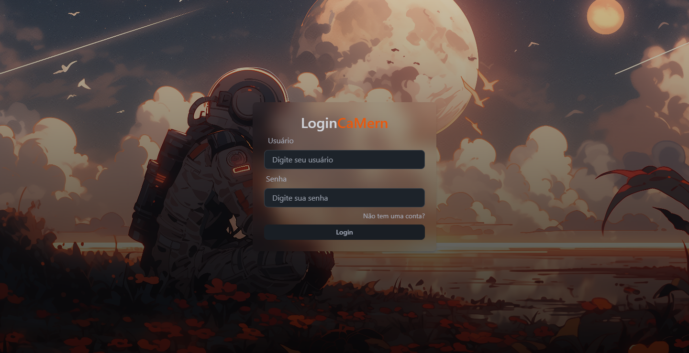</li>
      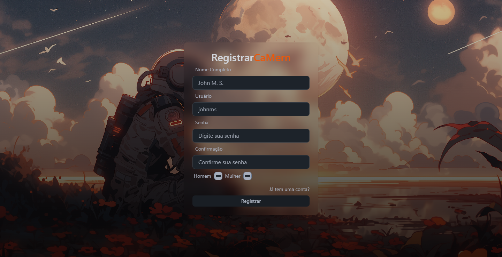</li>
    </div>
  </ul>
  <ul>
    <li><p style="font-size: 1.3em; font-weight: bold;">🏠 Home</p></li>
    <div style="display: flex; flex-direction: column;align-items:start;gap:8px">
      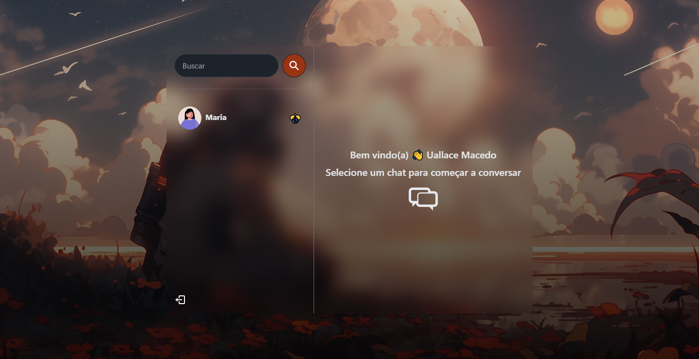</li>
      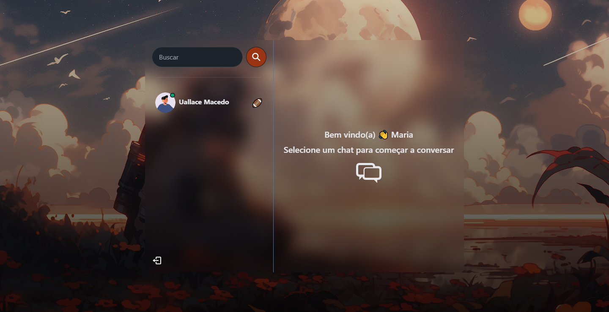</li>
      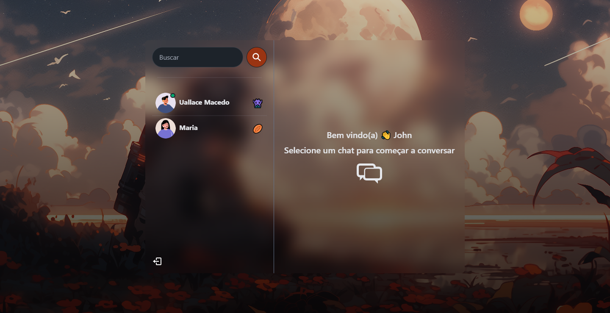</li>
    </div>
  </ul>
  <ul>
    <li><p style="font-size: 1.3em; font-weight: bold;">🗣️ Conversas</p></li>
    <div style="display: flex; flex-direction: column;align-items:start;gap:8px">
      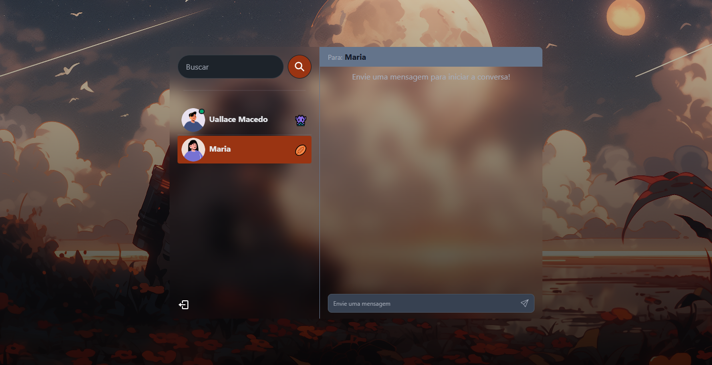</li>
      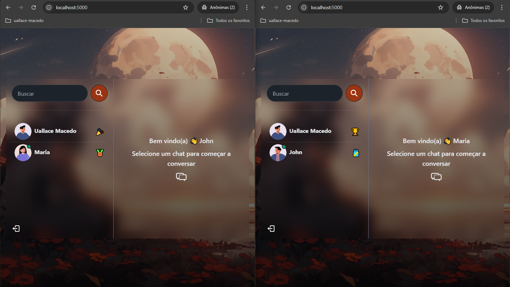</li>
      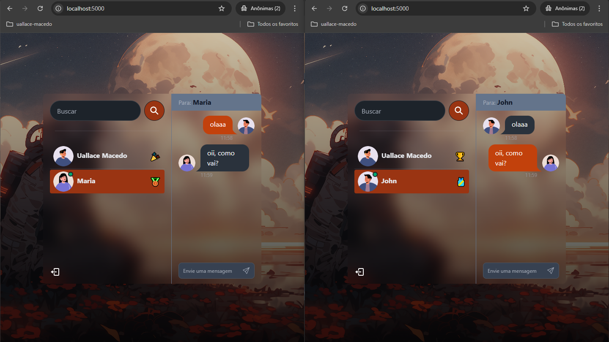</li>
    </div>
  </ul>
  <ul>
    <li><p style="font-size: 1.3em; font-weight: bold;">⚠️ Toasts de erro</p></li>
    <div style="display: flex; flex-direction: column;align-items:start;gap:8px">
      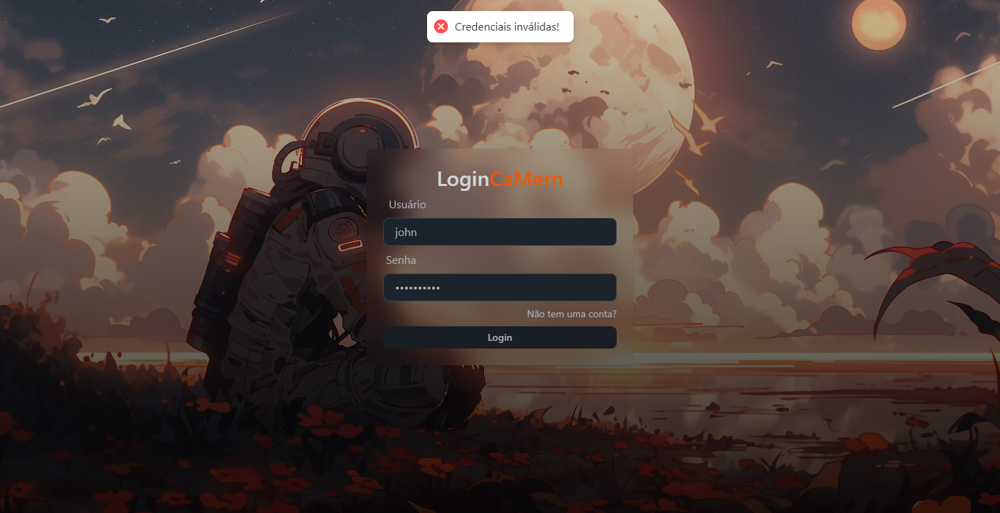</li>
      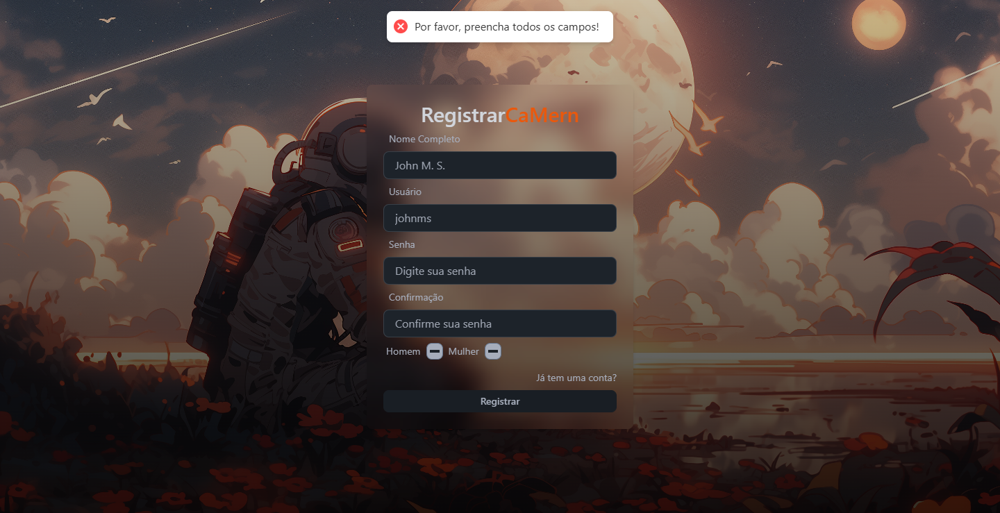</li>
      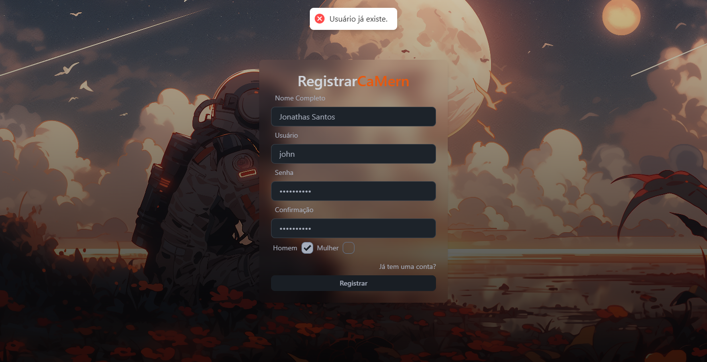</li>
    </div>
  </ul>
  <ul>
    <li><p style="font-size: 1.3em; font-weight: bold;">🍃 MongoDB</p></li>
    <p style="font-size: 1em; font-weight: bold;">Users</p>
    <div style="display: flex; flex-direction: column;align-items:start;gap:8px">
      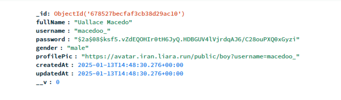</li>
    </div>
    <p style="font-size: 1em; font-weight: bold;">Conversations</p>
    <div style="display: flex; flex-direction: column;align-items:start;gap:8px">
      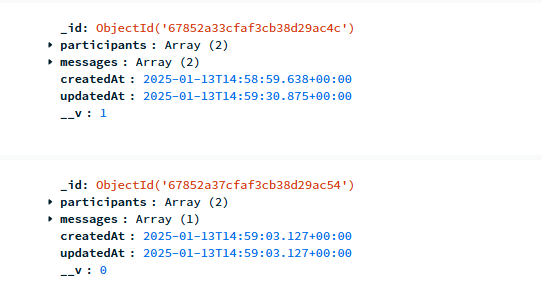</li>
    </div>
    <p style="font-size: 1em; font-weight: bold;">Messages</p>
    <div style="display: flex; flex-direction: column;align-items:start;gap:8px">
      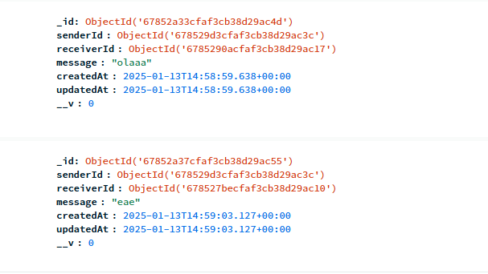</li>
    </div>
  </ul>
</div>